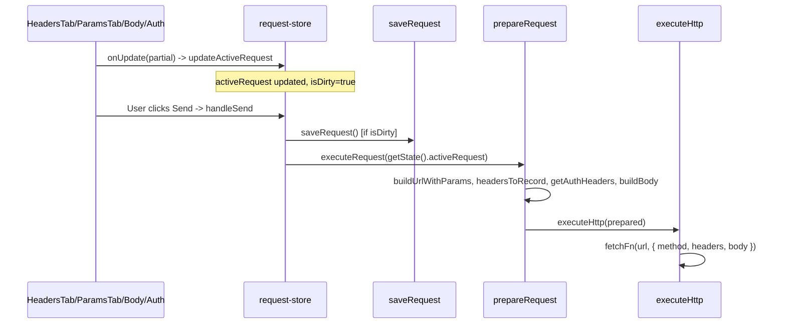

# Plan: Request headers / params / body / auth / script không đi kèm khi gọi API

## 1. Luồng hiện tại (đã rà soát)

- **Headers:** `request.headers` (KeyValuePair[]) → `headersToRecord` (chỉ lấy `enabled && key.trim()`) → `merged` (+ auth) → `prepared.headers` (Record<string, string>) → `init.headers` trong [http-client.ts](src/services/http-client.ts) L86–90.
- **Params:** `request.params` → `buildUrlWithParams` trong [request-preparer.ts](src/services/request-preparer.ts) và [url-params.ts](src/utils/url-params.ts) → nối vào `url` (chỉ params có `enabled && key.trim()`).
- **Body:** `request.body` → `buildBody` (json/raw/xml/form) → `prepared.body`.
- **Auth:** `getAuthHeaders(request.auth)` → merge vào `merged` trong prepareRequest.
- **Script:** Pre-script nhận `prepared`, trả `modifiedRequest`; response-store gán lại `prepared` rồi gọi `executeHttp(prepared)`.

Về mặt code, toàn bộ headers/params/body/auth đều được đưa vào `prepared` và `init` gửi cho `fetch`.

---

## 2. Nguyên nhân khả dĩ (headers “không có trong request”)

| #     | Nguyên nhân                                              | Cách kiểm chứng                                                                                                                                                                                                                                                                                                                                                                    |
| ----- | -------------------------------------------------------- | ---------------------------------------------------------------------------------------------------------------------------------------------------------------------------------------------------------------------------------------------------------------------------------------------------------------------------------------------------------------------------------- |
| **A** | **Gửi từ trình duyệt (localhost:1420) không phải Tauri** | Ở `http://localhost:1420` không có `window.__TAURI__` → dùng `globalThis.fetch`. Gọi sang origin khác (ví dụ API) + custom headers → CORS preflight; server không trả `Access-Control-Allow-Headers` → trình duyệt có thể chặn request hoặc bỏ headers.                                                                                                                            |
| **B** | **saveRequest() return sớm khi !isDirty**                | handleSend gọi `await saveRequest()` rồi `executeRequest(getState().activeRequest)`. Nếu user vừa sửa headers nhưng debounce 300ms chưa chạy, isDirty vẫn true; nếu đã chạy thì isDirty = false, saveRequest return ngay. Dù vậy ta vẫn lấy `getState().activeRequest` (in-memory) để execute, nên headers đã gõ trong UI phải nằm trong object này trừ khi có lỗi cập nhật state. |
| **C** | **Chuẩn hóa headers trước khi gọi fetch**                | Một số môi trường/plugin có thể yêu cầu `Headers` thay vì `Record<string, string>`. Hiện ta truyền thẳng `prepared.headers`; nếu runtime chỉ hỗ trợ `Headers`, headers có thể bị bỏ qua.                                                                                                                                                                                           |

Khuyến nghị ưu tiên: kiểm tra **A** (chạy trong Tauri desktop với cùng request để so sánh), sau đó **C** (thử truyền `new Headers(prepared.headers)` cho fetch).

---

## 3. Rà soát params, body, auth, script

- **Params:** Đã gắn vào URL trong `prepareRequest` qua `buildUrlWithParams`; không đi qua `init` của fetch. Nếu “params không có” thì cần xem URL cuối cùng có đúng query không (và request có đang dùng đúng `prepared.url` không).
- **Body:** Được set `init.body = prepared.body`; với POST/PUT/PATCH đã có trong `buildBody`. Form-urlencoded và JSON đều có; form-data theo code đang throw “not yet supported”.
- **Auth:** Được merge vào `merged` trong prepareRequest; auth headers không bị ghi đè bởi headers tay (vòng for auth sau). Ổn.
- **Script:** Pre-script nhận/trả `ScriptRequest` (headers: Record<string, string>); worker copy `outReq = { ...request }` rồi ghi đè method/url/body/headers từ script. Nếu script không set `req.headers`, headers gốc được giữ. Không thấy chỗ làm rỗng headers.

Kết luận rà soát: không phát hiện lỗi logic rõ ràng khiến params/body/auth/script bị bỏ; trọng tâm vẫn là **headers** và môi trường (CORS / format headers).

---

## 4. Hành động đề xuất (implementation)

### Bước 1: Xác nhận môi trường và chuẩn hóa headers (fix chắc chắn)

- Trong [http-client.ts](src/services/http-client.ts), trước khi gọi `fetchFn(prepared.url, init)`:
  - Chuẩn hóa `init.headers`: nếu `prepared.headers` là object, tạo `new Headers(prepared.headers)` và gán `init.headers = that` (hoặc giữ object nếu tài liệu plugin/fetch của môi trường chỉ chấp nhận object). Mục tiêu: loại trừ khả năng runtime bỏ qua headers vì format.
- (Tùy chọn) Thêm log dev-only: in `prepared.url`, `prepared.method`, số lượng headers và (nếu có) vài key đầu, trước khi gọi fetch — giúp xác nhận trên Tauri vs browser.

### Bước 2: Đảm bảo state dùng khi Send là mới nhất

- Trong [request-panel.tsx](src/components/request/request-panel.tsx) `handleSend`: sau `await saveRequest()`, tiếp tục dùng `const latest = useRequestStore.getState().activeRequest` (đã đúng). Có thể thêm ghi chú trong code: “Execute luôn dùng in-memory state để tránh race với debounce”.
- Không bắt buộc thay đổi saveRequest (ví dụ gọi save không điều kiện isDirty khi Send), vì dữ liệu execute đã lấy từ getState(); chỉ cần đảm bảo mọi cập nhật từ UI (HeadersTab, ParamsTab, Body, Auth) đều đi qua `updateActiveRequest` và không bị stale closure — hiện tại flow đã đúng.

### Bước 3: Kiểm chứng và tài liệu

- Chạy app trong **Tauri** (`pnpm tauri dev`), thêm header tùy ý (ví dụ `X-Test: 1`), Send tới [https://httpbin.org/headers](https://httpbin.org/headers) (hoặc endpoint trả về request headers). Nếu headers xuất hiện → lỗi chỉ xảy ra khi chạy trên browser (CORS).
- Cập nhật [CLAUDE.md](CLAUDE.md) hoặc [docs](docs/): khi gọi API từ **trình duyệt** (localhost:1420), request chịu CORS; custom headers có thể bị chặn nếu server không cho phép. Khuyến nghị dùng app desktop (Tauri) để gọi API có headers/body đầy đủ.

### Bước 4: Tạo issues GitLab (nếu xác nhận lỗi)

Theo [docs/gitlab-workflow-guide.md](docs/gitlab-workflow-guide.md):

- **Nếu lỗi là “headers không gửi khi chạy trong Tauri”** (sau khi kiểm chứng Bước 3):
  - Tạo 1 issue: title mô tả (ví dụ: “Headers (and/or params/body) not sent with request in desktop app”), description gồm: bước tái hiện, môi trường (OS, Tauri dev/build), kỳ vọng vs thực tế, và gợi ý fix (chuẩn hóa Headers, log prepared).
  - Dùng API trong guide: `POST "$API/issues"` với `PRIVATE-TOKEN`, body JSON `{"title":"...", "description":"...", "labels":["bug"]}`.
- **Nếu lỗi chỉ xảy ra trên browser (localhost:1420)**:
  - Tạo 1 issue (hoặc note trong doc): “API request from browser (localhost:1420) subject to CORS; custom headers may be stripped”. Label có thể là `documentation` hoặc `bug` tùy quy ước repo.

Không tạo issue cho từng mục params/body/auth/script trừ khi có bằng chứng cụ thể (ví dụ test/proxy log) cho thấy chúng không được gửi trong Tauri.

---

## 5. Tóm tắt

| Mục     | Trạng thái rà soát                                       | Hành động                                                                                               |
| ------- | -------------------------------------------------------- | ------------------------------------------------------------------------------------------------------- |
| Headers | Có thể do CORS (browser) hoặc format (Headers vs object) | Chuẩn hóa headers (Headers instance) trong http-client; kiểm chứng trên Tauri; ghi chú CORS trong docs. |
| Params  | Gắn đúng vào URL trong prepareRequest                    | Chỉ cần xác nhận URL cuối khi debug (log hoặc test).                                                    |
| Body    | Gắn đúng vào init.body                                   | Không thay đổi trừ khi có repro body thiếu.                                                             |
| Auth    | Merge đúng vào merged headers                            | Không thay đổi.                                                                                         |
| Script  | Pre/post dùng đúng prepared/modifiedRequest              | Không thay đổi.                                                                                         |

**Thứ tự thực hiện:** (1) Chuẩn hóa headers trong http-client + (tùy chọn) log prepared. (2) Test trên Tauri với httpbin (hoặc tương đương). (3) Cập nhật docs về CORS khi dùng browser. (4) Nếu vẫn lỗi trên Tauri hoặc cần track riêng CORS, tạo issue GitLab theo workflow guide.