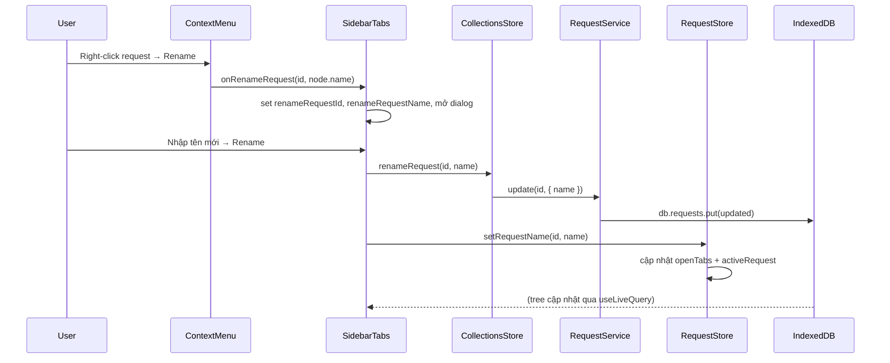

# Kế hoạch: Thêm tính năng Rename cho Request

## Bối cảnh

- Context menu request hiện tại (trong [collection-context-menu.tsx](src/components/collections/collection-context-menu.tsx)): **Copy as cURL**, **Duplicate**, **Move**, **Delete** — chưa có **Rename**.
- Collection và folder đã có Rename qua `onRenameCollection` / `onRenameFolder` và dialog [NameInputDialog](src/components/common/name-input-dialog.tsx).
- Request có trường `name` ([ApiRequest](src/types/models.ts)); [request-service.update](src/db/services/request-service.ts) đã hỗ trợ `Partial<ApiRequest>` (cập nhật `name`).
- [TreeNode](src/utils/tree-builder.ts) có `name` cho mọi node type, nên khi mở menu từ request có thể truyền `node.name` làm giá trị ban đầu.

## Luồng nghiệp vụ

## Thay đổi theo file

### 1. [src/components/collections/collection-context-menu.tsx](src/components/collections/collection-context-menu.tsx)

- Thêm prop: `onRenameRequest?: (id: string, name: string) => void`.
- Trong nhánh `node.type === 'request'`: thêm một mục **Rename** (chỉ render khi `onRenameRequest` tồn tại), đặt sau **Move**, trước separator và **Delete**. Gọi `onRenameRequest(node.id, node.name)` khi chọn.

### 2. [src/components/collections/collection-tree.tsx](src/components/collections/collection-tree.tsx)

- Trong `ContextMenuCallbacks`: thêm `onRenameRequest?: (id: string, name: string) => void` (optional để không phá API hiện tại).

### 3. [src/stores/collections-store.ts](src/stores/collections-store.ts)

- Thêm action: `renameRequest: (id: string, name: string) => Promise<void>`.
- Implement: gọi `requestService.update(id, { name })` (service đã có sẵn).

### 4. [src/components/collections/sidebar-tabs.tsx](src/components/collections/sidebar-tabs.tsx)

- State: `renameRequestId: string | null`, `renameRequestName: string` (khởi tạo `''`).
- Lấy `renameRequest` từ `useCollectionsStore` và `setRequestName` từ `useRequestStore`.
- Handler `handleRenameRequest(id: string, name: string)`: set `renameRequestId`, `renameRequestName` (dialog mở khi `renameRequestId !== null`).
- Thêm một instance [NameInputDialog](src/components/common/name-input-dialog.tsx):
  - `open={renameRequestId !== null}`
  - `onOpenChange`: khi đóng set `renameRequestId = null`
  - `title="Rename request"`, `placeholder="Request name"`, `confirmLabel="Rename"`
  - `initialName={renameRequestName}`
  - `onConfirm`: trong try/catch — gọi `await renameRequest(renameRequestId, name)`; nếu thành công gọi `setRequestName(renameRequestId, name)` rồi `setRenameRequestId(null)`. Nếu throw (vd. request không tồn tại): có thể toast lỗi, không clear `renameRequestId` để user đóng dialog thủ công.
- Truyền `onRenameRequest: handleRenameRequest` vào `contextMenuCallbacks` (và thêm vào dependency array của `useMemo` nếu cần).

### 5. [src/stores/request-store.ts](src/stores/request-store.ts)

- Thêm action: `setRequestName(id: string, name: string): void`.
- Implement: (1) cập nhật `openTabs` — map tab có `tab.id === id` thành `{ ...tab, name }`; (2) nếu `activeRequest?.id === id` thì set `activeRequest = { ...activeRequest, name }`. Nhờ đó tab bar ([request-tab-bar.tsx](src/components/request/request-tab-bar.tsx) đọc `tab.name` từ store) và pane request đang mở phản ánh tên mới ngay.

### 6. [src/db/services/request-service.ts](src/db/services/request-service.ts)

- Không thay đổi. `update(id, data)` đã hỗ trợ `data: Partial<...>` bao gồm `name`.

## Kiểm tra sau khi implement

- Chuột phải vào một request trong sidebar → có mục **Rename**.
- Chọn Rename → dialog mở với tên hiện tại điền sẵn.
- Đổi tên và bấm Rename → tên request trong cây cập nhật (Dexie live query); tab đang mở request đó (nếu có) cập nhật tên ngay nhờ gọi `setRequestName` trên request-store (tab bar đọc `openTabs[].name` từ store).
- Đóng dialog (Cancel hoặc click outside) → state clear, không gọi API.
- Validation: tên rỗng/trim không submit (NameInputDialog đã xử lý `trimmed` và nút disabled khi `!name.trim()`).

## Ghi chú

- Không cần dialog component mới; dùng trực tiếp `NameInputDialog` trong `sidebar-tabs` giống cách collection/folder dùng dialog create/rename.
- Request rename chỉ cập nhật IndexedDB; nếu sau này có sync, cần đảm bảo payload rename được đẩy vào `pending_sync` (theo kiến trúc offline-first hiện tại, mọi ghi qua store/request-service đã đi vào IndexedDB; sync layer có thể hook sau).
- **Tab/title đồng bộ**: Tab bar lấy tên từ `request-store.openTabs[].name`, không từ DB. Nếu không gọi `setRequestName` sau khi rename, tên trên tab sẽ cũ cho đến khi đổi tab. Bước 5 (request-store) là bắt buộc để UX đúng.
- **Lỗi khi rename**: `request-service.update` có thể throw (vd. request đã bị xóa). Trong `onConfirm` nên try/catch; khi lỗi không clear `renameRequestId`, có thể toast để user biết.
