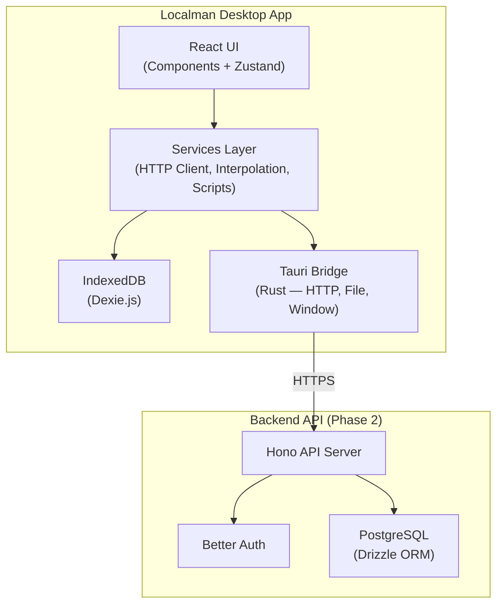
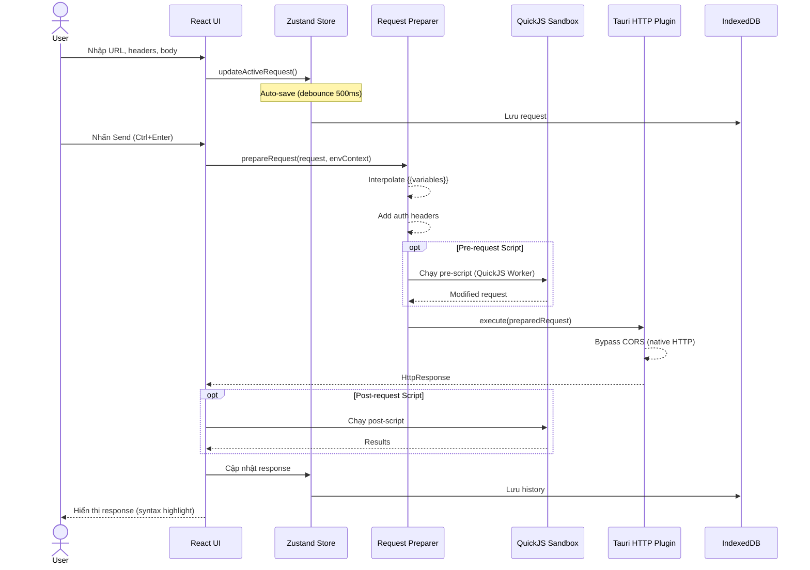
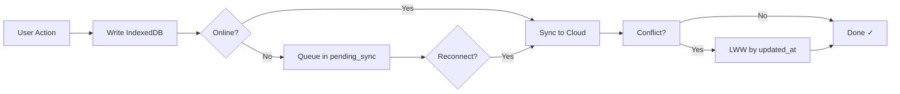
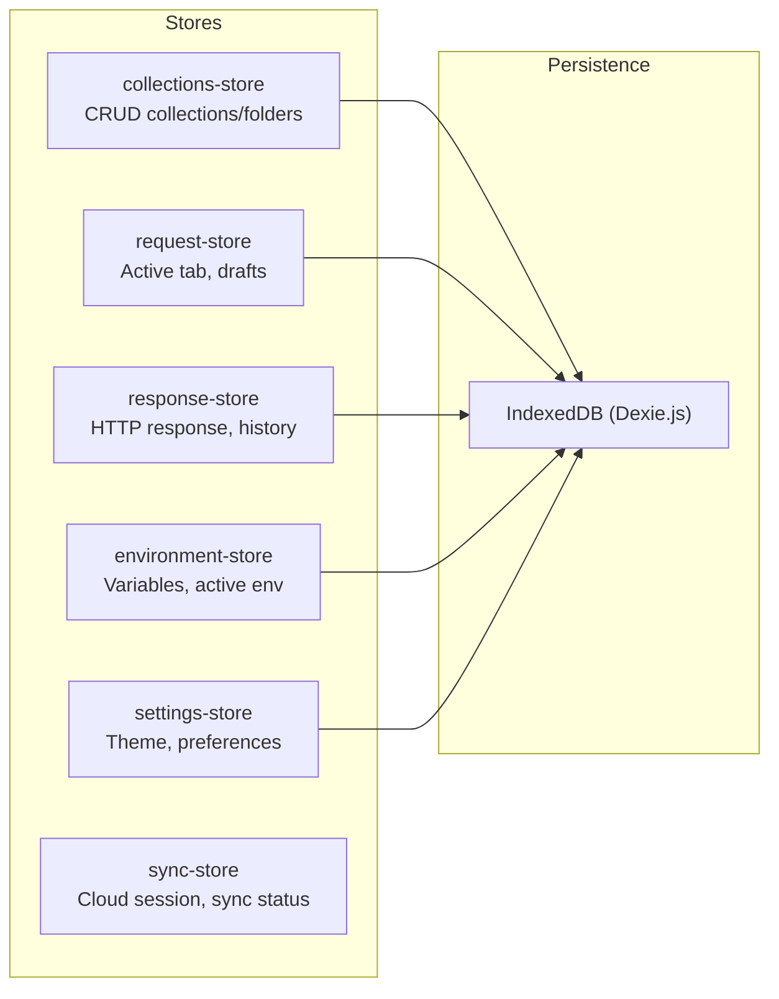
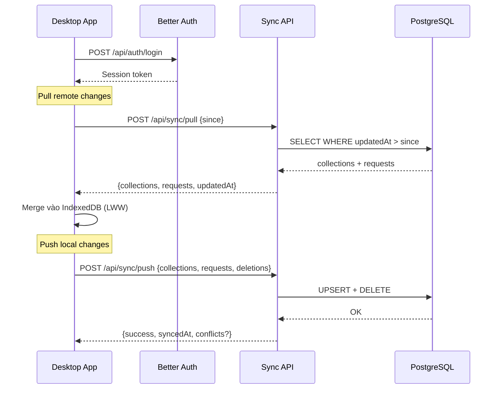
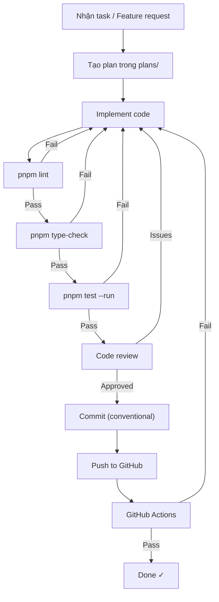
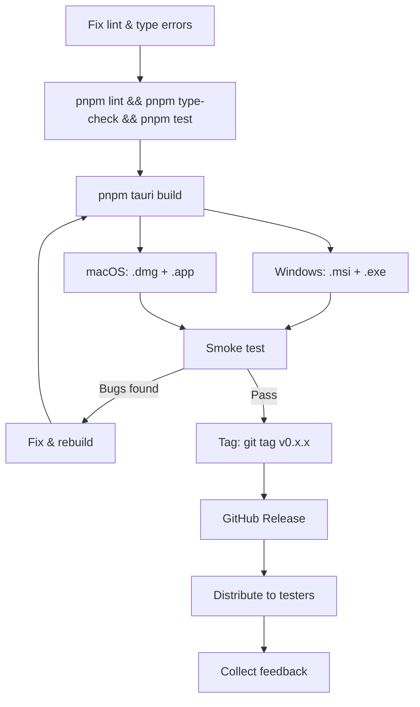
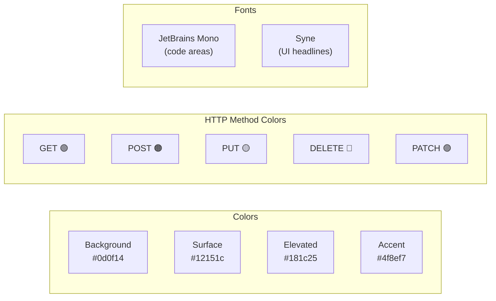

# Localman — Workflow Guide

Hướng dẫn quy trình phát triển, kiến trúc dữ liệu, và release workflow cho Localman.

## 1. Kiến trúc tổng quan



## 2. Luồng xử lý Request (Core Workflow)



## 3. Offline-First Data Flow



## 4. Quản lý State (Zustand Stores)



## 5. Cloud Sync Flow



## 6. Development Workflow



### Commands tham khảo nhanh

| Command | Mục đích |
|---------|----------|
| `pnpm tauri dev` | Dev server + Tauri window |
| `pnpm dev` | Vite dev server (browser only) |
| `pnpm lint` | ESLint check |
| `pnpm type-check` | TypeScript check |
| `pnpm test --run` | Vitest (41 tests) |
| `pnpm tauri build` | Build production app |
| `cargo check` | Check Rust compilation |
| `cargo clippy` | Rust linter |

## 7. Release Workflow



### Artifacts location

| Platform | Format | Path |
|----------|--------|------|
| Windows | `.msi` | `src-tauri/target/release/bundle/msi/` |
| Windows | `.exe` (NSIS) | `src-tauri/target/release/bundle/nsis/` |
| macOS | `.dmg` | `src-tauri/target/release/bundle/dmg/` |
| macOS | `.app` | `src-tauri/target/release/bundle/macos/` |

## 8. Cấu trúc thư mục

```
localman/
├── src/                    # Frontend React
│   ├── components/         # UI components
│   │   ├── layout/         # AppLayout, Titlebar, Sidebar, StatusBar
│   │   ├── request/        # RequestPanel, UrlBar, RequestTabs
│   │   ├── response/       # ResponseViewer, ResponseActions
│   │   ├── collections/    # CollectionTree, FolderItem
│   │   ├── environments/   # EnvironmentBar, EnvironmentManager
│   │   ├── import-export/  # ImportDialog, export utils
│   │   ├── settings/       # SettingsPage (6 tabs)
│   │   └── common/         # Toast, Modal, KeyboardShortcuts
│   ├── stores/             # Zustand state stores
│   ├── db/                 # Dexie.js IndexedDB layer
│   ├── services/           # HTTP client, sync, interpolation, scripts
│   ├── hooks/              # Custom React hooks
│   ├── utils/              # Helpers, URL params, tree builder
│   └── types/              # TypeScript type definitions
├── src-tauri/              # Rust/Tauri backend
│   ├── src/                # Rust source (main.rs, commands)
│   └── tauri.conf.json     # Tauri configuration
├── backend/                # Cloud sync backend (Hono + Better Auth)
│   ├── src/                # API routes, auth, DB schema
│   └── drizzle/            # Database migrations
├── docs/                   # Project documentation
├── plans/                  # Implementation plans
└── tests/                  # E2E tests (Playwright)
```

## 9. Keyboard Shortcuts

| Shortcut | Action |
|----------|--------|
| `Ctrl+Enter` | Send request |
| `Ctrl+T` | New tab |
| `Ctrl+W` | Close tab |
| `Ctrl+S` | Save request |
| `Ctrl+/` | Toggle keyboard shortcuts modal |

## 10. Design System



- **Spacing:** 4px base unit
- **Border radius:** 6–8px
- **Theme:** Dark-first
- **Feedback:** Toast notifications (no modals for minor actions)
