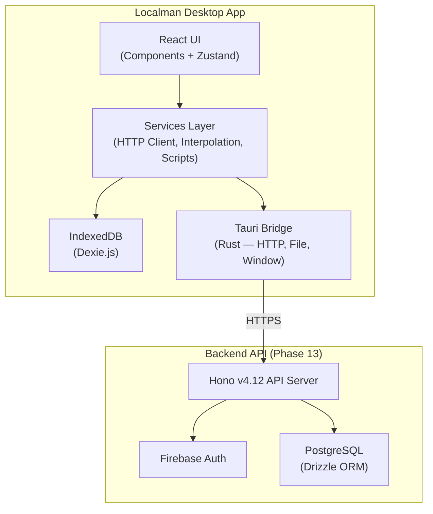
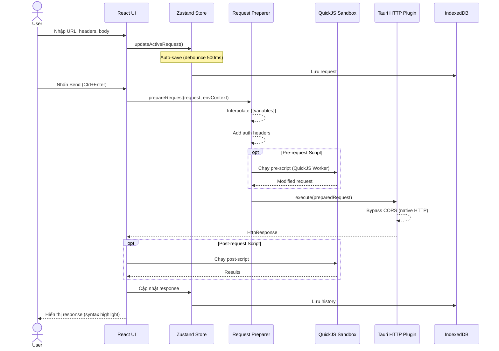
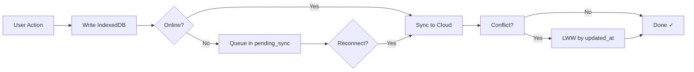
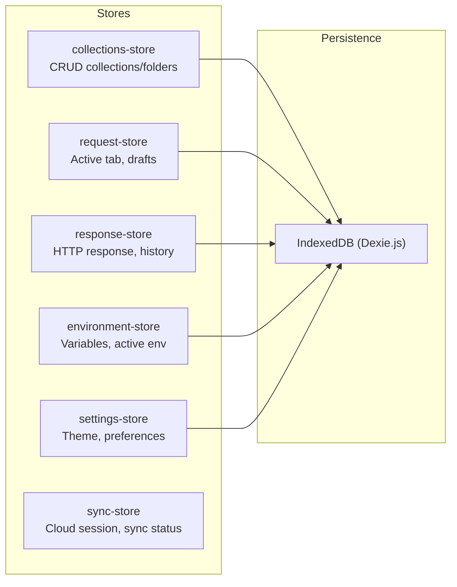
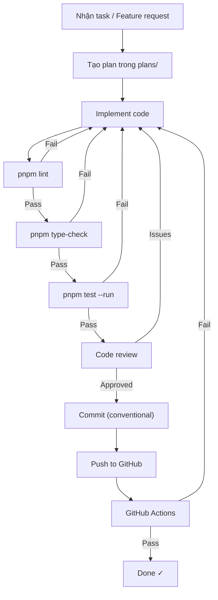
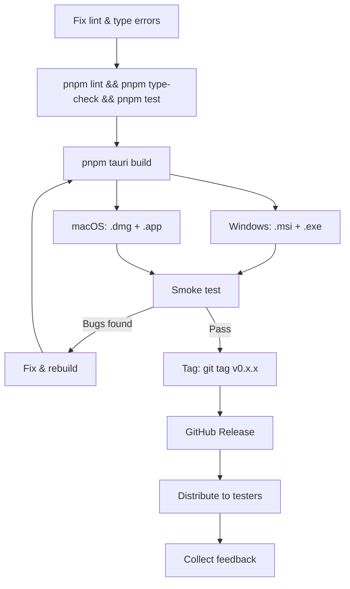
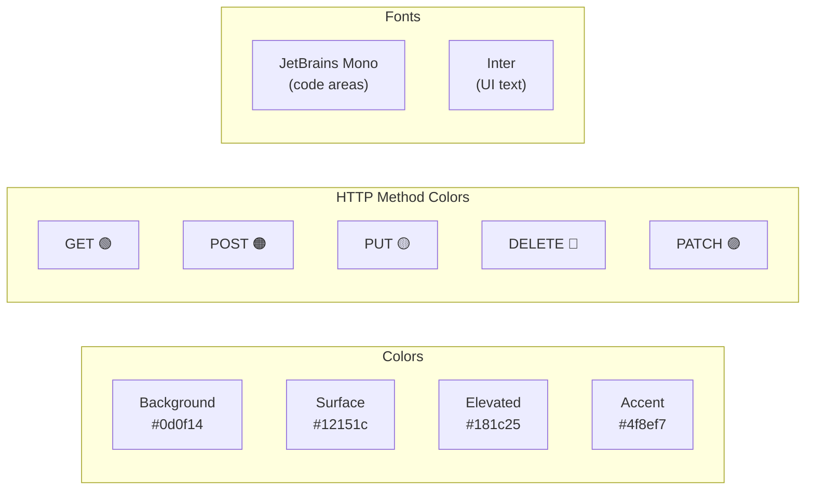

# Localman — Workflow Guide

Hướng dẫn quy trình phát triển, kiến trúc dữ liệu, và release workflow cho Localman.

## 1. Kiến trúc tổng quan



## 2. Luồng xử lý Request (Core Workflow)



## 3. Offline-First Data Flow



## 4. Quản lý State (Zustand Stores)



## 5. Cloud Sync Flow

```mermaid
sequenceDiagram
    participant App as Desktop App
    participant Auth as Firebase Auth
    participant Sync as Entity Sync API
    participant DB as PostgreSQL

    App->>Auth: Google OAuth login
    Auth-->>App: Firebase ID token + JWT

    Note over App: Pull remote changes
    App->>Sync: POST /api/workspaces/:wsId/sync/pull {entityType?, since?}
    Sync->>DB: SELECT WHERE updatedAt > since
    DB-->>Sync: entities + changeLog
    Sync-->>App: {collections, requests, conflicts?, updatedAt}
    App->>App: 3-way merge to IndexedDB

    Note over App: Push local changes
    App->>Sync: POST /api/workspaces/:wsId/sync/push {entities, deletions}
    Sync->>DB: Field-level merge + UPSERT
    DB-->>Sync: Conflicts (if any)
    Sync-->>App: {syncedAt, conflicts?}
```



## 6. Development Workflow



### Commands tham khảo nhanh

| Command | Mục đích |
|---------|----------|
| `pnpm tauri dev` | Dev server + Tauri window |
| `pnpm dev` | Vite dev server (browser only) |
| `pnpm lint` | ESLint check |
| `pnpm type-check` | TypeScript check |
| `pnpm test --run` | Vitest (35 tests) |
| `pnpm tauri build` | Build production app |
| `cargo check` | Check Rust compilation |
| `cargo clippy` | Rust linter |

## 7. Release Workflow



### Artifacts location

| Platform | Format | Path |
|----------|--------|------|
| Windows | `.msi` | `src-tauri/target/release/bundle/msi/` |
| Windows | `.exe` (NSIS) | `src-tauri/target/release/bundle/nsis/` |
| macOS | `.dmg` | `src-tauri/target/release/bundle/dmg/` |
| macOS | `.app` | `src-tauri/target/release/bundle/macos/` |

## 8. Cấu trúc thư mục

```
localman/
├── src/                    # Frontend React
│   ├── components/         # UI components (86 total)
│   │   ├── layout/         # AppLayout, Titlebar, Sidebar
│   │   ├── request/        # RequestPanel, UrlBar, RequestTabs
│   │   ├── response/       # ResponseViewer, syntax highlighting
│   │   ├── collections/    # CollectionTree, workspace filtering
│   │   ├── environments/   # EnvironmentSelector, interpolation
│   │   ├── settings/       # SettingsPage (General, Editor, Data, Account, Workspaces)
│   │   ├── sync/           # SyncStatusBadge, ConflictResolutionDialog
│   │   └── common/         # Toast, Modal, KeyboardShortcuts
│   ├── stores/             # Zustand state (11 stores: request, response, collections, sync, etc.)
│   ├── db/                 # Dexie.js IndexedDB layer (Dexie v4.3)
│   ├── services/           # HTTP client, sync, importers/exporters, scripts, snippets (50 files)
│   ├── hooks/              # Custom React hooks (5 custom hooks)
│   ├── utils/              # Helpers, variable interpolation, tree builder (11 utilities)
│   └── types/              # TypeScript type definitions (8 type files)
├── src-tauri/              # Rust/Tauri backend (Tauri 2)
│   ├── src/                # Rust source (plugin registration)
│   └── tauri.conf.json     # Tauri configuration
├── backend/                # Cloud sync API server (Hono 4.12 + PostgreSQL + Firebase Auth)
│   ├── src/                # API routes, middleware, DB schema, services
│   │   ├── routes/         # Health, workspace, collection, entity-sync, environment
│   │   ├── middleware/     # Firebase auth guard, RBAC, error handling
│   │   ├── db/             # Drizzle ORM schema (entities, workspaces, auth)
│   │   ├── services/       # Merge engine, change log, workspace logic
│   │   └── ws/             # WebSocket server (channels, presence, auth)
│   ├── drizzle/            # Database migrations
│   └── ecosystem.config.cjs # PM2 deployment config
├── docs/                   # Project documentation (7 guides)
├── plans/                  # Development phases and implementation plans
├── .github/workflows/      # GitHub Actions CI/CD (lint, test, release builds)
└── tests/                  # Vitest unit tests (35 tests) + Playwright E2E
```

## 9. Keyboard Shortcuts

| Shortcut | Action |
|----------|--------|
| `Ctrl+Enter` | Send request |
| `Ctrl+T` | New tab |
| `Ctrl+W` | Close tab |
| `Ctrl+S` | Save request |
| `Ctrl+/` | Toggle keyboard shortcuts modal |

## 10. Design System



- **Spacing:** 4px base unit
- **Border radius:** 6–8px
- **Theme:** Dark-first
- **Feedback:** Toast notifications (no modals for minor actions)
