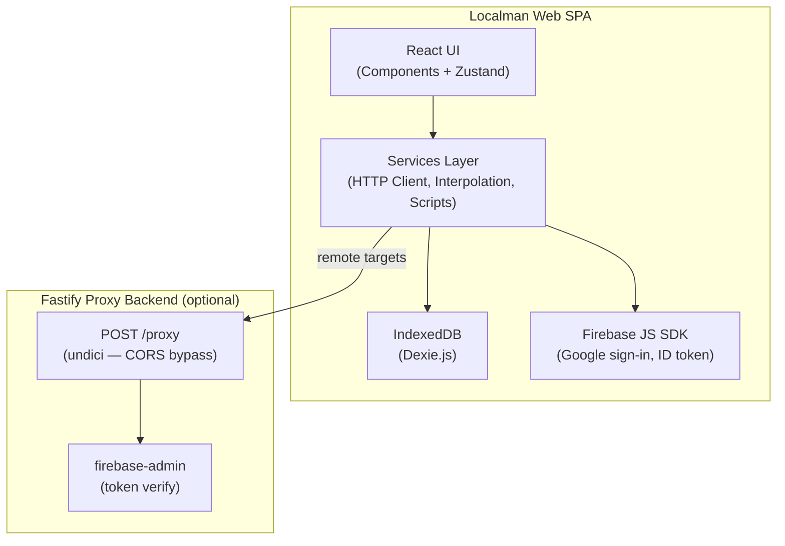
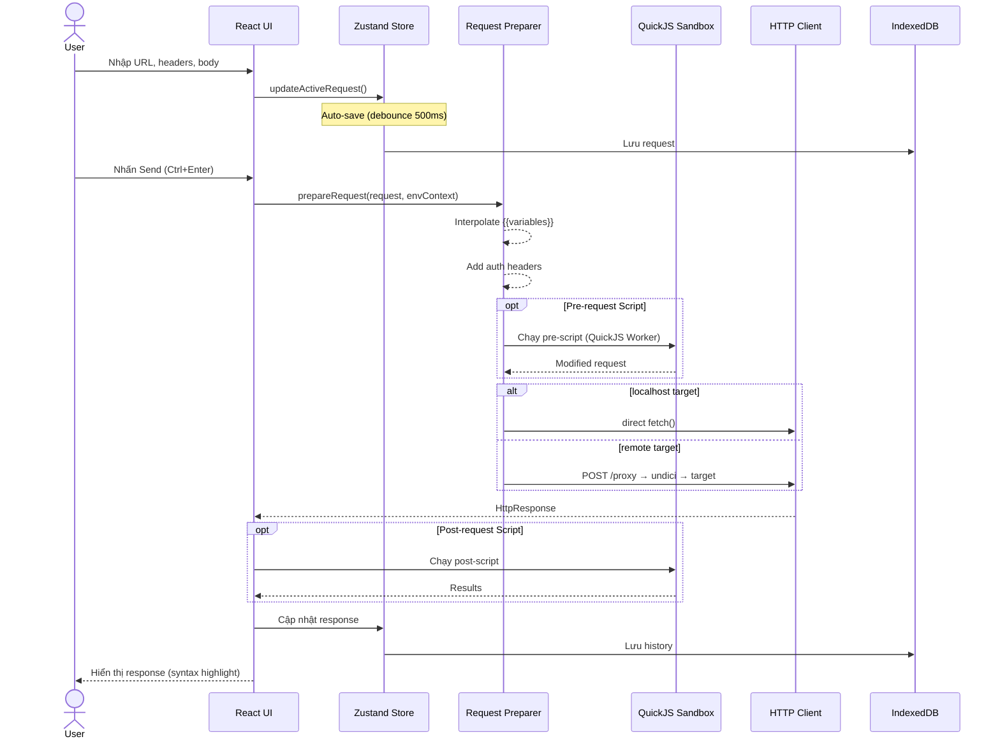
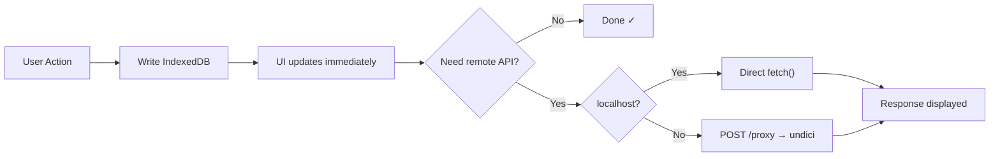
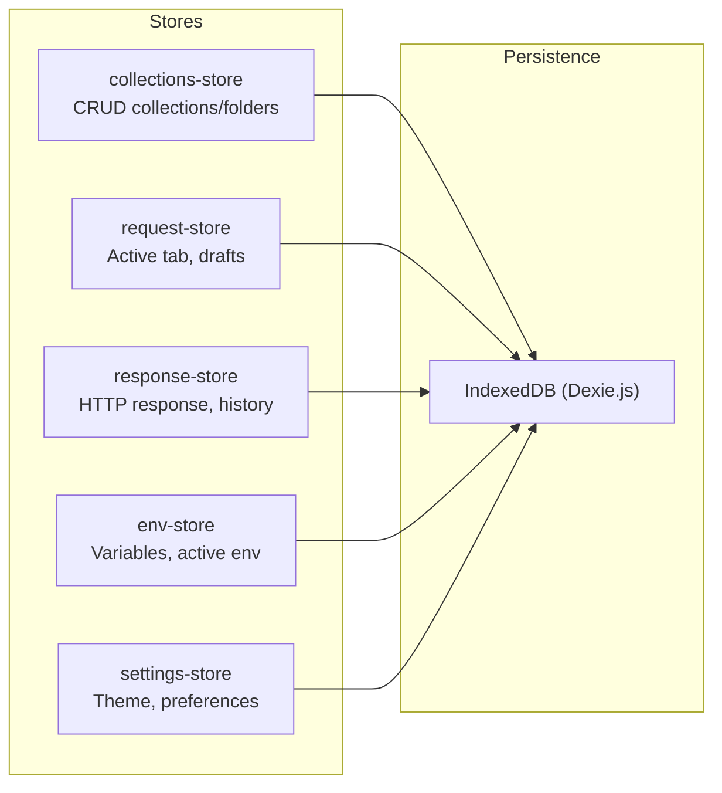
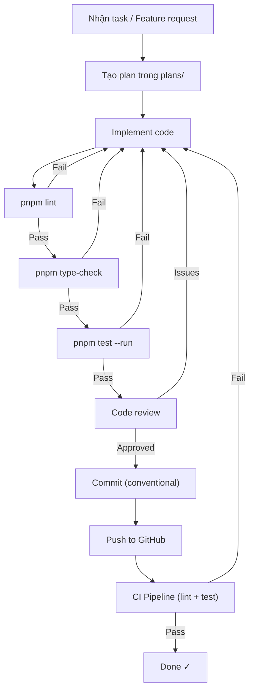
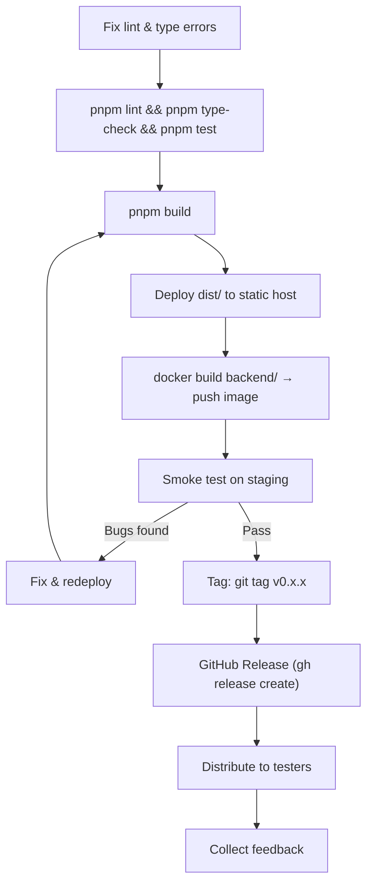
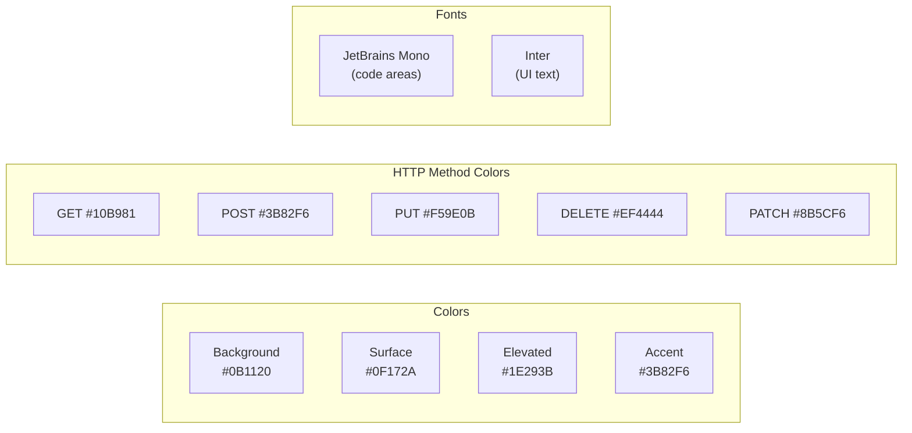

# Localman — Workflow Guide

Hướng dẫn quy trình phát triển, kiến trúc dữ liệu, và release workflow cho Localman.

## 1. Kiến trúc tổng quan


```mermaid
graph TB
    subgraph SPA["Localman Web SPA"]
        UI["React UI<br/>(Components + Zustand)"]
        Services["Services Layer<br/>(HTTP Client, Interpolation, Scripts)"]
        DB["IndexedDB<br/>(Dexie.js)"]
        Firebase["Firebase JS SDK<br/>(Google sign-in, ID token)"]
    end

    subgraph Backend["Fastify Proxy Backend (optional)"]
        Proxy["POST /proxy<br/>(undici — CORS bypass)"]
        Auth["firebase-admin<br/>(token verify)"]
    end

    UI --> Services
    Services --> DB
    Services --> Firebase
    Services -->|"remote targets"| Proxy
    Proxy --> Auth
```

## 2. Luồng xử lý Request (Core Workflow)


```mermaid
sequenceDiagram
    actor User
    participant UI as React UI
    participant Store as Zustand Store
    participant Prep as Request Preparer
    participant Script as QuickJS Sandbox
    participant HTTP as HTTP Client
    participant IDB as IndexedDB

    User->>UI: Nhập URL, headers, body
    UI->>Store: updateActiveRequest()
    Note over Store: Auto-save (debounce 500ms)
    Store->>IDB: Lưu request

    User->>UI: Nhấn Send (Ctrl+Enter)
    UI->>Prep: prepareRequest(request, envContext)
    Prep-->>Prep: Interpolate {{variables}}
    Prep-->>Prep: Add auth headers

    opt Pre-request Script
        Prep->>Script: Chạy pre-script (QuickJS Worker)
        Script-->>Prep: Modified request
    end

    alt localhost target
        Prep->>HTTP: direct fetch()
    else remote target
        Prep->>HTTP: POST /proxy → undici → target
    end
    HTTP-->>UI: HttpResponse

    opt Post-request Script
        UI->>Script: Chạy post-script
        Script-->>UI: Results
    end

    UI->>Store: Cập nhật response
    Store->>IDB: Lưu history
    UI-->>User: Hiển thị response (syntax highlight)
```

## 3. Offline-First Data Flow


```mermaid
flowchart LR
    A["User Action"] --> B["Write IndexedDB"]
    B --> C["UI updates immediately"]
    C --> D{"Need remote API?"}
    D -->|No| E["Done ✓"]
    D -->|Yes| F{"localhost?"}
    F -->|Yes| G["Direct fetch()"]
    F -->|No| H["POST /proxy → undici"]
    G --> I["Response displayed"]
    H --> I
```

## 4. Quản lý State (Zustand Stores)


```mermaid
graph LR
    subgraph Stores
        CS["collections-store<br/>CRUD collections/folders"]
        RS["request-store<br/>Active tab, drafts"]
        RES["response-store<br/>HTTP response, history"]
        ES["env-store<br/>Variables, active env"]
        SS["settings-store<br/>Theme, preferences"]
    end

    subgraph Persistence
        IDB["IndexedDB (Dexie.js)"]
    end

    CS --> IDB
    RS --> IDB
    RES --> IDB
    ES --> IDB
    SS --> IDB
```

## 5. Development Workflow


```mermaid
flowchart TD
    A["Nhận task / Feature request"] --> B["Tạo plan trong plans/"]
    B --> C["Implement code"]
    C --> D["pnpm lint"]
    D -->|Fail| C
    D -->|Pass| E["pnpm type-check"]
    E -->|Fail| C
    E -->|Pass| F["pnpm test --run"]
    F -->|Fail| C
    F -->|Pass| G["Code review"]
    G -->|Issues| C
    G -->|Approved| H["Commit (conventional)"]
    H --> I["Push to GitHub"]
    I --> J["CI Pipeline (lint + test)"]
    J -->|Fail| C
    J -->|Pass| K["Done ✓"]
```

### Commands tham khảo nhanh

| Command | Mục đích |
|---------|----------|
| `pnpm dev:all` | FE (Vite :5173) + BE (Fastify :3000) concurrently |
| `pnpm dev` | Vite dev server only |
| `pnpm dev:be` | Fastify proxy only |
| `pnpm lint` | ESLint check |
| `pnpm type-check` | TypeScript check |
| `pnpm test --run` | Vitest |
| `pnpm build` | Build frontend → dist/ |
| `pnpm --filter backend build` | Compile backend TypeScript |

## 6. Release Workflow


```mermaid
flowchart TD
    A["Fix lint & type errors"] --> B["pnpm lint && pnpm type-check && pnpm test"]
    B --> C["pnpm build"]
    C --> D["Deploy dist/ to static host"]
    D --> E["docker build backend/ → push image"]
    E --> F["Smoke test on staging"]
    F -->|Bugs found| G["Fix & redeploy"]
    G --> C
    F -->|Pass| H["Tag: git tag v0.x.x"]
    H --> I["GitHub Release (gh release create)"]
    I --> J["Distribute to testers"]
    J --> K["Collect feedback"]
```

## 7. Cấu trúc thư mục

```
localman/
├── src/                    # Frontend React SPA
│   ├── components/         # UI components
│   │   ├── layout/         # MainLayout, Titlebar, Sidebar
│   │   ├── request/        # RequestPanel, UrlBar, RequestTabs
│   │   ├── collections/    # CollectionTree, FolderItem
│   │   ├── settings/       # SettingsPage, auth form
│   │   └── common/         # Toast, ErrorBoundary, KeyValueEditor
│   ├── stores/             # Zustand state stores
│   ├── db/                 # Dexie.js IndexedDB layer
│   ├── services/           # HTTP client, interpolation, scripts, snippets
│   ├── utils/              # Helpers, feature-flags, db-error-handler
│   └── types/              # TypeScript type definitions
├── backend/                # Fastify proxy backend
│   └── src/                # index.ts, auth.ts, proxy.ts
├── docs/                   # Project documentation
├── plans/                  # Implementation plans
└── tests/                  # Vitest unit tests
```

## 8. Keyboard Shortcuts

| Shortcut | Action |
|----------|--------|
| `Ctrl+Enter` | Send request |
| `Ctrl+T` | New tab |
| `Ctrl+W` | Close tab |
| `Ctrl+S` | Save request |
| `Ctrl+/` | Toggle keyboard shortcuts modal |

## 9. Design System


```mermaid
graph LR
    subgraph Colors
        BG["Background<br/>#0B1120"]
        SF["Surface<br/>#0F172A"]
        EL["Elevated<br/>#1E293B"]
        AC["Accent<br/>#3B82F6"]
    end

    subgraph Methods["HTTP Method Colors"]
        GET["GET #10B981"]
        POST["POST #3B82F6"]
        PUT["PUT #F59E0B"]
        DEL["DELETE #EF4444"]
        PATCH["PATCH #8B5CF6"]
    end

    subgraph Fonts
        Code["JetBrains Mono<br/>(code areas)"]
        UI["Inter<br/>(UI text)"]
    end
```

- **Spacing:** 4px base unit
- **Border radius:** 6–8px
- **Theme:** Dark-first
- **Feedback:** Toast notifications (no modals for minor actions)
